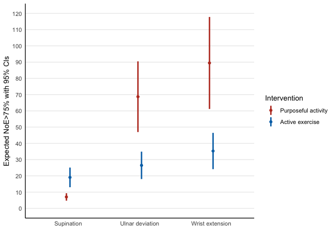

-   <a href="#statistical-analysis-plan"
    id="toc-statistical-analysis-plan">Statistical Analysis Plan</a>
-   <a href="#results-of-primary-analysis"
    id="toc-results-of-primary-analysis">Results of Primary Analysis</a>
    -   <a href="#maxer" id="toc-maxer">MaxER</a>
    -   <a href="#noe75" id="toc-noe75">NoE&gt;75%</a>
    -   <a href="#nor" id="toc-nor">NoR</a>
    -   <a href="#poat" id="toc-poat">PoAT</a>
    -   <a href="#importance" id="toc-importance">Importance</a>
    -   <a href="#enjoyment" id="toc-enjoyment">Enjoyment</a>
    -   <a href="#challenge" id="toc-challenge">Challenge</a>
-   <a href="#statistical-models" id="toc-statistical-models">Statistical
    Models</a>
    -   <a href="#maxer-estimation-and-hypothesis-tests"
        id="toc-maxer-estimation-and-hypothesis-tests">MaxER Estimation and
        Hypothesis Tests</a>
        -   <a href="#model-with-carry-over-effects"
            id="toc-model-with-carry-over-effects">Model with Carry-over Effects</a>
        -   <a href="#test-for-carry-over-effects"
            id="toc-test-for-carry-over-effects">Test for Carry-over Effects</a>
        -   <a href="#model-without-carry-over-effects"
            id="toc-model-without-carry-over-effects">Model without Carry-over
            Effects</a>
        -   <a href="#model-diagnostics" id="toc-model-diagnostics">Model
            Diagnostics</a>
        -   <a href="#hypothesis-tests" id="toc-hypothesis-tests">Hypothesis
            Tests</a>
        -   <a href="#expected-maxer-with-95-cis"
            id="toc-expected-maxer-with-95-cis">Expected MaxER with 95% CIs</a>
        -   <a href="#visualisation-of-expected-maxer"
            id="toc-visualisation-of-expected-maxer">Visualisation of Expected
            MaxER</a>
        -   <a href="#overall-model-summary" id="toc-overall-model-summary">Overall
            Model Summary</a>
    -   <a href="#noe75-estimation-and-hypothesis-tests"
        id="toc-noe75-estimation-and-hypothesis-tests">NoE&gt;75% Estimation and
        Hypothesis Tests</a>
        -   <a href="#model-with-carry-over-effects-1"
            id="toc-model-with-carry-over-effects-1">Model with Carry-over
            Effects</a>
        -   <a href="#test-for-carry-over-effects-1"
            id="toc-test-for-carry-over-effects-1">Test for Carry-over Effects</a>
        -   <a href="#model-without-carry-over-effects-1"
            id="toc-model-without-carry-over-effects-1">Model without Carry-over
            Effects</a>
        -   <a href="#hypothesis-tests-1" id="toc-hypothesis-tests-1">Hypothesis
            Tests</a>
        -   <a href="#expected-noe75-with-95-cis"
            id="toc-expected-noe75-with-95-cis">Expected NoE&gt;75% with 95% CIs</a>
        -   <a href="#visualisation-of-expected-noe75"
            id="toc-visualisation-of-expected-noe75">Visualisation of Expected
            NoE&gt;75%</a>
        -   <a href="#overall-model-summary-1"
            id="toc-overall-model-summary-1">Overall Model Summary</a>
    -   <a href="#nor-estimation-and-hypothesis-tests"
        id="toc-nor-estimation-and-hypothesis-tests">NoR Estimation and
        Hypothesis Tests</a>
        -   <a href="#model-with-carry-over-effects-2"
            id="toc-model-with-carry-over-effects-2">Model with Carry-over
            Effects</a>
        -   <a href="#test-for-carry-over-effects-2"
            id="toc-test-for-carry-over-effects-2">Test for Carry-over Effects</a>
        -   <a href="#model-without-carry-over-effects-2"
            id="toc-model-without-carry-over-effects-2">Model without Carry-over
            Effects</a>
        -   <a href="#hypothesis-tests-2" id="toc-hypothesis-tests-2">Hypothesis
            Tests</a>
        -   <a href="#expected-nor-with-95-cis"
            id="toc-expected-nor-with-95-cis">Expected NoR with 95% CIs</a>
        -   <a href="#visualisation-of-expected-nor"
            id="toc-visualisation-of-expected-nor">Visualisation of Expected NoR</a>
        -   <a href="#overall-model-summary-2"
            id="toc-overall-model-summary-2">Overall Model Summary</a>
    -   <a href="#poat-estimation-and-hypothesis-tests"
        id="toc-poat-estimation-and-hypothesis-tests">PoAT Estimation and
        Hypothesis Tests</a>
        -   <a href="#model-with-carry-over-effects-3"
            id="toc-model-with-carry-over-effects-3">Model with Carry-over
            Effects</a>
        -   <a href="#test-for-carry-over-effects-3"
            id="toc-test-for-carry-over-effects-3">Test for Carry-over Effects</a>
        -   <a href="#model-without-carry-over-effects-3"
            id="toc-model-without-carry-over-effects-3">Model without Carry-over
            Effects</a>
        -   <a href="#hypothesis-tests-3" id="toc-hypothesis-tests-3">Hypothesis
            Tests</a>
        -   <a href="#expected-poat-with-95-cis"
            id="toc-expected-poat-with-95-cis">Expected PoAT with 95% CIs</a>
        -   <a href="#visualisation-of-expected-poat"
            id="toc-visualisation-of-expected-poat">Visualisation of Expected
            PoAT</a>
        -   <a href="#overall-model-summary-3"
            id="toc-overall-model-summary-3">Overall Model Summary</a>
    -   <a href="#importance-1" id="toc-importance-1">Importance</a>
        -   <a href="#model-with-carry-over-effects-4"
            id="toc-model-with-carry-over-effects-4">Model with Carry-over
            Effects</a>
        -   <a href="#test-for-carry-over-effects-4"
            id="toc-test-for-carry-over-effects-4">Test for Carry-over Effects</a>
        -   <a href="#model-without-carry-over-effects-4"
            id="toc-model-without-carry-over-effects-4">Model without Carry-over
            Effects</a>
        -   <a href="#hypothesis-tests-4" id="toc-hypothesis-tests-4">Hypothesis
            Tests</a>
    -   <a href="#enjoyment-1" id="toc-enjoyment-1">Enjoyment</a>
        -   <a href="#model-with-carry-over-effects-5"
            id="toc-model-with-carry-over-effects-5">Model with Carry-over
            Effects</a>
        -   <a href="#test-for-carry-over-effects-5"
            id="toc-test-for-carry-over-effects-5">Test for Carry-over Effects</a>
        -   <a href="#model-without-carry-over-effects-5"
            id="toc-model-without-carry-over-effects-5">Model without Carry-over
            Effects</a>
        -   <a href="#hypothesis-tests-5" id="toc-hypothesis-tests-5">Hypothesis
            Tests</a>
    -   <a href="#challenge-1" id="toc-challenge-1">Challenge</a>
        -   <a href="#model-with-carry-over-effects-6"
            id="toc-model-with-carry-over-effects-6">Model with Carry-over
            Effects</a>
        -   <a href="#test-for-carry-over-effects-6"
            id="toc-test-for-carry-over-effects-6">Test for Carry-over Effects</a>
        -   <a href="#model-without-carry-over-effects-6"
            id="toc-model-without-carry-over-effects-6">Model without Carry-over
            Effects</a>
        -   <a href="#hypothesis-tests-6" id="toc-hypothesis-tests-6">Hypothesis
            Tests</a>

# Statistical Analysis Plan

The statistical analysis plan described for the primary outcome is
repeated for the following secondary outcomes: Maximum end range
(MaxER), Number of excursions beyond 75% of end range (NoE\>75%), Number
of Repetitions (NoR), Percentage of active time (PoAT), Importance,
Enjoyment and Challenge. However, a few changes are made in the
regression models. For NoE\>75%, NoR and PoAT, a linear mixed regression
model is not possible because the model residuals are skewed and the
homogeneity of variance assumption is violated. Instead a generalized
linear mixed regression model is setup. This model assumes that the
outcome has a Gamma distribution. The rest of the fixed and random
effects structure of the model is similar to the TMV model. For
Importance, Enjoyment and Challenge, the mean difference across
Interventions is modeled with a linear mixed regression model which
includes a fixed effect for Intervention and a random intercept for
participant.

# Results of Primary Analysis

## MaxER

The raw data for MaxER is illustrated in the below figure in a box and
scatter plot. Lower MaxER is observed in Intervention PA compared to
Intervention AE in “Sup” movement category.

<!-- -->

No carry-over effect is detected in the data. The general trend observed
in the raw MaxER is confirmed by the statistical model. Intervention PA
has lower MaxER in “Sup” movement category. The movement-wise difference
between Intervention PA and AE is: supination *Δ* = -5.7 95% CI \[-9.8,
-1.6\], t\[170\] = -2.756, p = 0.006; ulnar deviation *Δ* = 0.3 95% CI
\[-1.3, 2.0\], t\[170\] = 0.422, p = 0.673; wrist extension *Δ* = -0.9
95% CI \[-2.7, 0.9\], t\[170\] = -0.951, p = 0.343.

## NoE\>75%

The raw data for NoE\>75% is illustrated in the below figure in a box
and scatter plot. Lower NoE\>75% is observed in Intervention PA compared
to Intervention AE in “Sup” movement category. In “UD” and “WE”
categories, higher NoE\>75% is observed in Intervention PA.

<!-- -->

No carry-over effect is detected in the data. The movement-wise
difference between Intervention PA and AE is: supination *Δ* = -12 95%
CI \[-18, -6\], z = -3.703, p = 0.0002; ulnar deviation *Δ* = 42 95% CI
\[19, 65\], z = 3.566, p = 0.0004; wrist extension *Δ* = 54 95% CI \[24,
85\], z = 3.492, p = 0.0005.

## NoR

The raw data for NoR is illustrated in the below figure in a box and
scatter plot. Higher NoR is observed in Intervention PA compared to
Intervention AE in “EF” and “Rot” categories.

<!-- -->

No carry-over effect is detected in the data. The movement-wise
difference between Intervention PA and AE is: ulnar deviation *Δ* = -0.2
95% CI \[-1.7, 1.3\], z = -0.296, p = 0.77; wrist extension/flexion *Δ*
= 67.9 95% CI \[49.4, 86.4\], z = 7.193, p \< 0.0001; rotation *Δ* =
117.5 95% CI \[94.4, 140.7\], z = 9.948, p \< 0.0001.

## PoAT

The raw data for PoAT is illustrated in the below figure in a box and
scatter plot. Higher PoAT is observed in Intervention PA compared to
Intervention AE in all movement categories.

<!-- -->

No carry-over effect is detected in the data. The movement-wise
difference between Intervention PA and AE is: ulnar deviation *Δ* = 59
95% CI \[56, 62\], z = 36.133, p \< 0.0001; wrist extension/flexion *Δ*
= 53 95% CI \[50, 57\], z = 29.969, p \< 0.0001; rotation *Δ* = 52 95%
CI \[49, 56\], z = 28.500, p \< 0.0001.

## Importance

The raw data for Importance is illustrated in the below figure.

<!-- -->

No carry-over effect is detected in the data. The mean difference
between Intervention PA and AE is -0.2 95% CI \[-0.4, 0\], T\[34\] =
-1.871, p = 0.07.

## Enjoyment

The raw data for Enjoyment is illustrated in the below figure.

<!-- -->

No carry-over effect is detected in the data. The mean difference
between Intervention PA and AE is 0.4 95% CI \[-0.2, 1\], T\[34\] =
1.46, p = 0.154.

## Challenge

The raw data for Challenge is illustrated in the below figure.

<!-- -->

No carry-over effect is detected in the data. The mean difference
between Intervention PA and AE is -0.5 95% CI \[-0.9, -0.1\], T\[34\] =
-2.359, p = 0.024.

# Statistical Models

## MaxER Estimation and Hypothesis Tests

### Model with Carry-over Effects

``` r
Model <- lme(Value ~ Movement*Intervention + Intervention*Period,
             random = ~ Movement|Participant,
             data = subset(Datasource, Outcome == "MaxER"),
             weights = varIdent(form = ~1|Movement))
```

### Test for Carry-over Effects

|                     | Num. D.F. | Den. D.F. | F-value | P-value |
|:--------------------|----------:|----------:|--------:|--------:|
| Intervention:Period |         1 |       168 |   0.031 |    0.86 |

### Model without Carry-over Effects

``` r
Model <- lme(Value ~ Movement*Intervention,
             random = ~ Movement|Participant,
             data = subset(Datasource, Outcome == "MaxER"),
             weights = varIdent(form = ~1|Movement))
```

### Model Diagnostics

<!-- -->

### Hypothesis Tests

| Contrast                              | Movement        | Difference |  SE | D.F. | 95% CI Lower | 95% CI Upper | T-value | P-value |
|:--------------------------------------|:----------------|-----------:|----:|-----:|-------------:|-------------:|--------:|--------:|
| Purposeful activity - Active exercise | Supination      |       -5.7 | 2.1 |  170 |         -9.8 |         -1.6 |  -2.756 |   0.006 |
| Purposeful activity - Active exercise | Ulnar deviation |        0.3 | 0.8 |  170 |         -1.3 |          2.0 |   0.422 |   0.673 |
| Purposeful activity - Active exercise | Wrist extension |       -0.9 | 0.9 |  170 |         -2.7 |          0.9 |  -0.951 |   0.343 |

### Expected MaxER with 95% CIs

| Intervention        | Movement        | Expected MaxER | 95% CI Lower | 95% CI Upper |
|:--------------------|:----------------|---------------:|-------------:|-------------:|
| Purposeful activity | Supination      |           34.3 |         29.5 |         39.1 |
| Active exercise     | Supination      |           40.0 |         35.2 |         44.8 |
| Purposeful activity | Ulnar deviation |           18.1 |         15.6 |         20.7 |
| Active exercise     | Ulnar deviation |           17.8 |         15.2 |         20.3 |
| Purposeful activity | Wrist extension |           33.7 |         29.8 |         37.5 |
| Active exercise     | Wrist extension |           34.5 |         30.7 |         38.4 |

### Visualisation of Expected MaxER

<!-- -->

### Overall Model Summary

    Linear mixed-effects model fit by REML
      Data: subset(Datasource, Outcome == "MaxER") 
           AIC      BIC    logLik
      1474.341 1524.113 -722.1706

    Random effects:
     Formula: ~Movement | Participant
     Structure: General positive-definite, Log-Cholesky parametrization
                            StdDev    Corr         
    (Intercept)             10.913382 (Intr) MvmnUd
    MovementUlnar deviation 10.282989 -0.807       
    MovementWrist extension 13.404153 -0.644  0.764
    Residual                 3.409367              

    Variance function:
     Structure: Different standard deviations per stratum
     Formula: ~1 | Movement 
     Parameter estimates:
    Ulnar deviation Wrist extension      Supination 
           1.000000        1.112990        2.551444 
    Fixed effects:  Value ~ Movement * Intervention 
                                                            Value Std.Error  DF
    (Intercept)                                          34.28629  2.359002 170
    MovementUlnar deviation                             -16.17886  2.348452 170
    MovementWrist extension                              -0.60200  2.776120 170
    InterventionActive exercise                           5.73057  2.079413 170
    MovementUlnar deviation:InterventionActive exercise  -6.07486  2.233422 170
    MovementWrist extension:InterventionActive exercise  -4.86829  2.268646 170
                                                          t-value p-value
    (Intercept)                                         14.534232  0.0000
    MovementUlnar deviation                             -6.889158  0.0000
    MovementWrist extension                             -0.216849  0.8286
    InterventionActive exercise                          2.755860  0.0065
    MovementUlnar deviation:InterventionActive exercise -2.719977  0.0072
    MovementWrist extension:InterventionActive exercise -2.145899  0.0333
     Correlation: 
                                                        (Intr) MvmnUd MvmnWe IntrAe
    MovementUlnar deviation                             -0.857                     
    MovementWrist extension                             -0.741  0.793              
    InterventionActive exercise                         -0.441  0.443  0.375       
    MovementUlnar deviation:InterventionActive exercise  0.410 -0.476 -0.349 -0.931
    MovementWrist extension:InterventionActive exercise  0.404 -0.406 -0.409 -0.917
                                                        MUd:Ie
    MovementUlnar deviation                                   
    MovementWrist extension                                   
    InterventionActive exercise                               
    MovementUlnar deviation:InterventionActive exercise       
    MovementWrist extension:InterventionActive exercise  0.853

    Standardized Within-Group Residuals:
            Min          Q1         Med          Q3         Max 
    -2.30802146 -0.44501414 -0.07758663  0.37458256  2.34976068 

    Number of Observations: 210
    Number of Groups: 35 

## NoE\>75% Estimation and Hypothesis Tests

### Model with Carry-over Effects

``` r
Model <- glmer(Value+1 ~ Movement*Intervention + Intervention*Period +
                 (Movement|Participant),
               family = Gamma(link = "identity"),
               data = subset(Datasource, Outcome == "NoE>75%"),
               control = glmerControl(optimizer = c("nmkbw")),
               nAGQ = 0)
```

### Test for Carry-over Effects

|                     | Chi-squared | D.F. | P-value |
|:--------------------|------------:|-----:|--------:|
| Intervention:Period |       0.231 |    1 |   0.631 |

### Model without Carry-over Effects

``` r
Model <- glmer(Value+1 ~ Movement*Intervention +
                 (Movement|Participant),
               family = Gamma(link = "identity"),
               data = subset(Datasource, Outcome == "NoE>75%"),
               control = glmerControl(optimizer = c("nmkbw")),
               nAGQ = 0)
```

### Hypothesis Tests

| Contrast                              | Movement        | Difference |  SE | 95% CI Lower | 95% CI Upper | Z-value | P-value |
|:--------------------------------------|:----------------|-----------:|----:|-------------:|-------------:|--------:|:--------|
| Purposeful activity - Active exercise | Supination      |        -12 |   3 |          -18 |           -6 |  -3.703 | \<0.001 |
| Purposeful activity - Active exercise | Ulnar deviation |         42 |  12 |           19 |           65 |   3.566 | \<0.001 |
| Purposeful activity - Active exercise | Wrist extension |         54 |  16 |           24 |           85 |   3.492 | \<0.001 |

### Expected NoE\>75% with 95% CIs

| Intervention        | Movement        | Expected NoE\>75% | 95% CI Lower | 95% CI Upper |
|:--------------------|:----------------|------------------:|-------------:|-------------:|
| Purposeful activity | Supination      |                 7 |            5 |            9 |
| Active exercise     | Supination      |                19 |           13 |           25 |
| Purposeful activity | Ulnar deviation |                69 |           47 |           90 |
| Active exercise     | Ulnar deviation |                26 |           18 |           35 |
| Purposeful activity | Wrist extension |                89 |           61 |          118 |
| Active exercise     | Wrist extension |                35 |           24 |           46 |

### Visualisation of Expected NoE\>75%

<!-- -->

### Overall Model Summary

    Generalized linear mixed model fit by maximum likelihood (Adaptive
      Gauss-Hermite Quadrature, nAGQ = 0) [glmerMod]
     Family: Gamma  ( identity )
    Formula: Value + 1 ~ Movement * Intervention + (Movement | Participant)
       Data: subset(Datasource, Outcome == "NoE>75%")
    Control: glmerControl(optimizer = c("nmkbw"))

         AIC      BIC   logLik deviance df.resid 
      1908.3   1951.8   -941.2   1882.3      197 

    Scaled residuals: 
        Min      1Q  Median      3Q     Max 
    -1.0319 -0.6613 -0.2839  0.4594  5.0371 

    Random effects:
     Groups      Name                    Variance Std.Dev. Corr       
     Participant (Intercept)             5.4751   2.3399              
                 MovementUlnar deviation 6.2728   2.5046    1.00      
                 MovementWrist extension 0.2972   0.5452   -1.00 -1.00
     Residual                            0.9116   0.9548              
    Number of obs: 210, groups:  Participant, 35

    Fixed effects:
                                                        Estimate Std. Error t value
    (Intercept)                                            7.022      1.167   6.016
    MovementUlnar deviation                               61.693     11.133   5.541
    MovementWrist extension                               82.464     14.482   5.694
    InterventionActive exercise                           12.029      3.249   3.703
    MovementUlnar deviation:InterventionActive exercise  -54.281     12.287  -4.418
    MovementWrist extension:InterventionActive exercise  -66.223     15.857  -4.176
                                                        Pr(>|z|)    
    (Intercept)                                         1.79e-09 ***
    MovementUlnar deviation                             3.00e-08 ***
    MovementWrist extension                             1.24e-08 ***
    InterventionActive exercise                         0.000213 ***
    MovementUlnar deviation:InterventionActive exercise 9.97e-06 ***
    MovementWrist extension:InterventionActive exercise 2.96e-05 ***
    ---
    Signif. codes:  0 '***' 0.001 '**' 0.01 '*' 0.05 '.' 0.1 ' ' 1

    Correlation of Fixed Effects:
                (Intr) MvmnUd MvmnWe IntrAe MUd:Ie
    MvmntUlnrdv -0.080                            
    MvmntWrstex -0.073  0.007                     
    IntrvntnAce -0.317  0.033  0.026              
    MvmntUd:IAe  0.084 -0.905 -0.007 -0.265       
    MvmntWe:IAe  0.065 -0.007 -0.913 -0.205  0.054

## NoR Estimation and Hypothesis Tests

### Model with Carry-over Effects

``` r
Model <- glmer(Value+1 ~ Movement*Intervention + Intervention*Period +
                 (1|Participant),
               data = subset(Datasource, Outcome == "NoR"),
               family = Gamma(link = "identity"),
               control = glmerControl(optimizer = "bobyqa"))
```

### Test for Carry-over Effects

|                     | Chi-squared | D.F. | P-value |
|:--------------------|------------:|-----:|--------:|
| Intervention:Period |   100822438 |    1 |       0 |

### Model without Carry-over Effects

``` r
Model <- glmer(Value+1 ~ Movement*Intervention +
                 (1|Participant),
               family = Gamma(link = "identity"),
               data = subset(Datasource, Outcome == "NoR"),
               control = glmerControl(optimizer = "bobyqa"))
```

### Hypothesis Tests

| Contrast                              | Movement          | Difference |   SE | 95% CI Lower | 95% CI Upper | Z-value | P-value |
|:--------------------------------------|:------------------|-----------:|-----:|-------------:|-------------:|--------:|:--------|
| Purposeful activity - Active exercise | Rotation          |      117.5 | 11.6 |         94.8 |        140.3 |  10.147 | \<0.001 |
| Purposeful activity - Active exercise | Deviation         |       -0.2 |  0.8 |         -1.7 |          1.3 |  -0.296 | 0.767   |
| Purposeful activity - Active exercise | Extension-Flexion |       67.9 |  9.5 |         49.2 |         86.6 |   7.123 | \<0.001 |

### Expected NoR with 95% CIs

| Intervention        | Movement          | Expected NoR | 95% CI Lower | 95% CI Upper |
|:--------------------|:------------------|-------------:|-------------:|-------------:|
| Purposeful activity | Rotation          |        160.6 |        137.5 |        183.6 |
| Active exercise     | Rotation          |         43.0 |         34.9 |         51.1 |
| Purposeful activity | Deviation         |         31.8 |         24.7 |         39.0 |
| Active exercise     | Deviation         |         32.1 |         24.9 |         39.3 |
| Purposeful activity | Extension-Flexion |        119.6 |        101.0 |        138.3 |
| Active exercise     | Extension-Flexion |         51.7 |         42.8 |         60.6 |

### Visualisation of Expected NoR

<!-- -->

### Overall Model Summary

    Generalized linear mixed model fit by maximum likelihood (Laplace
      Approximation) [glmerMod]
     Family: Gamma  ( identity )
    Formula: Value + 1 ~ Movement * Intervention + (1 | Participant)
       Data: subset(Datasource, Outcome == "NoR")
    Control: glmerControl(optimizer = "bobyqa")

         AIC      BIC   logLik deviance df.resid 
      1957.7   1984.5   -970.8   1941.7      202 

    Scaled residuals: 
        Min      1Q  Median      3Q     Max 
    -1.7981 -0.5194 -0.1445  0.5702  3.2743 

    Random effects:
     Groups      Name        Variance Std.Dev.
     Participant (Intercept) 145.0347 12.0430 
     Residual                  0.2494  0.4994 
    Number of obs: 210, groups:  Participant, 35

    Fixed effects:
                                                          Estimate Std. Error
    (Intercept)                                             160.57      11.78
    MovementDeviation                                      -128.72      11.45
    MovementExtension-Flexion                               -40.92      14.28
    InterventionActive exercise                            -117.55      11.58
    MovementDeviation:InterventionActive exercise           117.78      11.60
    MovementExtension-Flexion:InterventionActive exercise    49.63      14.67
                                                          t value Pr(>|z|)    
    (Intercept)                                            13.635  < 2e-16 ***
    MovementDeviation                                     -11.239  < 2e-16 ***
    MovementExtension-Flexion                              -2.866 0.004157 ** 
    InterventionActive exercise                           -10.147  < 2e-16 ***
    MovementDeviation:InterventionActive exercise          10.150  < 2e-16 ***
    MovementExtension-Flexion:InterventionActive exercise   3.383 0.000717 ***
    ---
    Signif. codes:  0 '***' 0.001 '**' 0.01 '*' 0.05 '.' 0.1 ' ' 1

    Correlation of Fixed Effects:
                (Intr) MvmntD MvmE-F IntrAe MD:IAe
    MovemntDvtn -0.951                            
    MvmntExtn-F -0.749  0.767                     
    IntrvntnAce -0.937  0.980  0.756              
    MvmntDv:IAe  0.936 -0.980 -0.755 -0.998       
    MvmnE-F:IAe  0.726 -0.745 -0.970 -0.761  0.760

## PoAT Estimation and Hypothesis Tests

### Model with Carry-over Effects

``` r
Model <- glmer(Value ~ Movement*Intervention + Intervention*Period +
                 (1|Participant),
               data = subset(Datasource, Outcome == "PoAT"),
               family = Gamma(link = "identity"),
               control = glmerControl(optimizer = "bobyqa"))
```

### Test for Carry-over Effects

|                     | Chi-squared | D.F. | P-value |
|:--------------------|------------:|-----:|--------:|
| Intervention:Period |       0.597 |    1 |    0.44 |

### Model without Carry-over Effects

``` r
Model <- glmer(Value ~ Movement*Intervention +
                 (1|Participant),
               family = Gamma(link = "identity"),
               data = subset(Datasource, Outcome == "PoAT"),
               control = glmerControl(optimizer = "bobyqa"))
```

### Hypothesis Tests

| Contrast                              | Movement          | Difference |  SE | 95% CI Lower | 95% CI Upper | Z-value | P-value |
|:--------------------------------------|:------------------|-----------:|----:|-------------:|-------------:|--------:|:--------|
| Purposeful activity - Active exercise | Rotation          |         52 |   2 |           49 |           56 |  28.535 | \<0.001 |
| Purposeful activity - Active exercise | Deviation         |         59 |   2 |           56 |           62 |  36.127 | \<0.001 |
| Purposeful activity - Active exercise | Extension-Flexion |         53 |   2 |           50 |           57 |  29.975 | \<0.001 |

### Expected PoAT with 95% CIs

| Intervention        | Movement          | Expected PoAT | 95% CI Lower | 95% CI Upper |
|:--------------------|:------------------|--------------:|-------------:|-------------:|
| Purposeful activity | Rotation          |            98 |           94 |          103 |
| Active exercise     | Rotation          |            46 |           42 |           50 |
| Purposeful activity | Deviation         |            91 |           87 |           96 |
| Active exercise     | Deviation         |            33 |           29 |           36 |
| Purposeful activity | Extension-Flexion |            97 |           92 |          101 |
| Active exercise     | Extension-Flexion |            43 |           40 |           47 |

### Visualisation of Expected PoAT

<!-- -->

### Overall Model Summary

    Generalized linear mixed model fit by maximum likelihood (Laplace
      Approximation) [glmerMod]
     Family: Gamma  ( identity )
    Formula: Value ~ Movement * Intervention + (1 | Participant)
       Data: subset(Datasource, Outcome == "PoAT")
    Control: glmerControl(optimizer = "bobyqa")

         AIC      BIC   logLik deviance df.resid 
      1435.5   1462.3   -709.8   1419.5      202 

    Scaled residuals: 
        Min      1Q  Median      3Q     Max 
    -2.3452 -0.5297 -0.0512  0.5463  3.6716 

    Random effects:
     Groups      Name        Variance Std.Dev.
     Participant (Intercept) 24.89557 4.9895  
     Residual                 0.01452 0.1205  
    Number of obs: 210, groups:  Participant, 35

    Fixed effects:
                                                          Estimate Std. Error
    (Intercept)                                             98.424      2.438
    MovementDeviation                                       -7.001      2.267
    MovementExtension-Flexion                               -1.909      2.328
    InterventionActive exercise                            -52.149      1.828
    MovementDeviation:InterventionActive exercise           -6.632      2.445
    MovementExtension-Flexion:InterventionActive exercise   -1.070      2.546
                                                          t value Pr(>|z|)    
    (Intercept)                                            40.370  < 2e-16 ***
    MovementDeviation                                      -3.088  0.00202 ** 
    MovementExtension-Flexion                              -0.820  0.41204    
    InterventionActive exercise                           -28.535  < 2e-16 ***
    MovementDeviation:InterventionActive exercise          -2.713  0.00667 ** 
    MovementExtension-Flexion:InterventionActive exercise  -0.420  0.67430    
    ---
    Signif. codes:  0 '***' 0.001 '**' 0.01 '*' 0.05 '.' 0.1 ' ' 1

    Correlation of Fixed Effects:
                (Intr) MvmntD MvmE-F IntrAe MD:IAe
    MovemntDvtn -0.499                            
    MvmntExtn-F -0.486  0.522                     
    IntrvntnAce -0.623  0.665  0.648              
    MvmntDv:IAe  0.463 -0.927 -0.484 -0.746       
    MvmnE-F:IAe  0.445 -0.477 -0.914 -0.717  0.536

## Importance

### Model with Carry-over Effects

``` r
Datasource.IEC$Importance <- as.numeric(Datasource.IEC$Importance)
Model <- lmer(Importance ~ Intervention*Period +
                (1|Participant),
              data = Datasource.IEC)
```

### Test for Carry-over Effects

|                     | Chi-squared | D.F. | P-value |
|:--------------------|------------:|-----:|--------:|
| Intervention:Period |       1.172 |    1 |   0.279 |

### Model without Carry-over Effects

``` r
Model <- lmer(Importance ~ Intervention +
                (1|Participant),
              data = Datasource.IEC)
```

### Hypothesis Tests

| Contrast                              | Difference |  SE | D.F. | 95% CI Lower | 95% CI Upper | T-value | P-value |
|:--------------------------------------|-----------:|----:|-----:|-------------:|-------------:|--------:|--------:|
| Purposeful activity - Active exercise |       -0.2 | 0.1 |   34 |         -0.4 |            0 |  -1.871 |    0.07 |

## Enjoyment

### Model with Carry-over Effects

``` r
Datasource.IEC$Enjoyment <- as.numeric(Datasource.IEC$Enjoyment)
Model <- lmer(Enjoyment ~ Intervention*Period +
                (1|Participant),
              data = Datasource.IEC)
```

### Test for Carry-over Effects

|                     | Chi-squared | D.F. | P-value |
|:--------------------|------------:|-----:|--------:|
| Intervention:Period |       0.481 |    1 |   0.488 |

### Model without Carry-over Effects

``` r
Model <- lmer(Enjoyment ~ Intervention +
                (1|Participant),
              data = Datasource.IEC)
```

### Hypothesis Tests

| Contrast                              | Difference |  SE | D.F. | 95% CI Lower | 95% CI Upper | T-value | P-value |
|:--------------------------------------|-----------:|----:|-----:|-------------:|-------------:|--------:|--------:|
| Purposeful activity - Active exercise |        0.4 | 0.3 |   34 |         -0.2 |            1 |    1.46 |   0.154 |

## Challenge

### Model with Carry-over Effects

``` r
Datasource.IEC$Challenge <- as.numeric(Datasource.IEC$Challenge)
Model <- lmer(Challenge ~ Intervention*Period +
                (1|Participant),
              data = Datasource.IEC)
```

### Test for Carry-over Effects

|                     | Chi-squared | D.F. | P-value |
|:--------------------|------------:|-----:|--------:|
| Intervention:Period |        0.05 |    1 |   0.824 |

### Model without Carry-over Effects

``` r
Model <- lmer(Challenge ~ Intervention +
                (1|Participant),
              data = Datasource.IEC)
```

### Hypothesis Tests

| Contrast                              | Difference |  SE | D.F. | 95% CI Lower | 95% CI Upper | T-value | P-value |
|:--------------------------------------|-----------:|----:|-----:|-------------:|-------------:|--------:|--------:|
| Purposeful activity - Active exercise |       -0.5 | 0.2 |   34 |         -0.9 |         -0.1 |  -2.359 |   0.024 |
